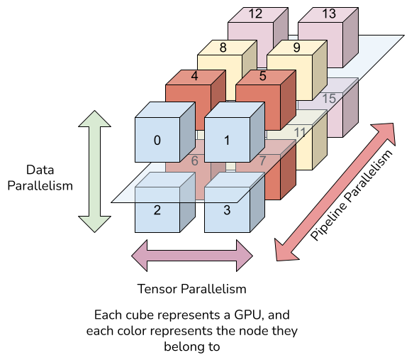
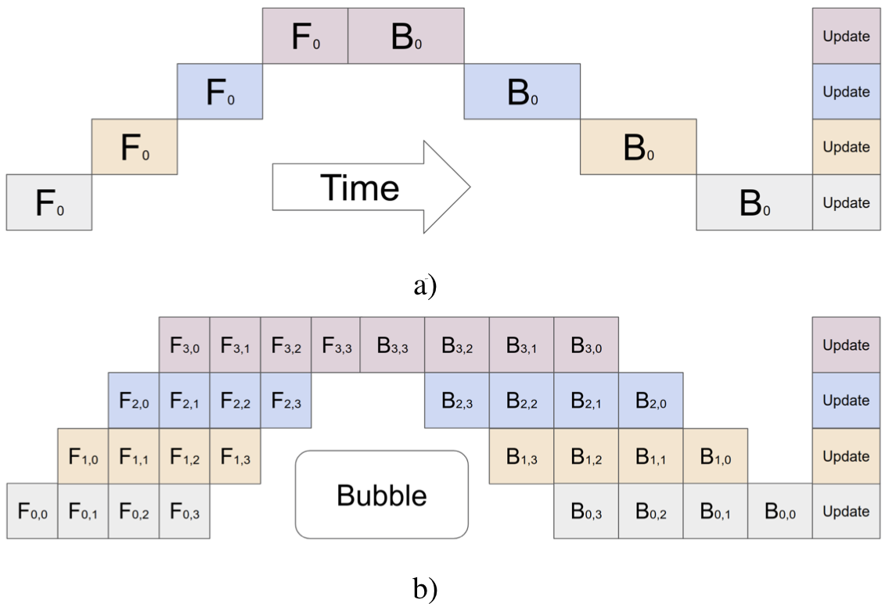
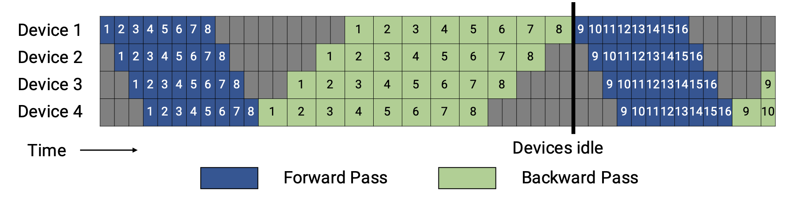
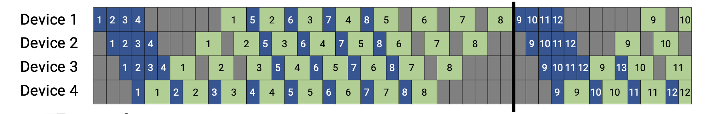
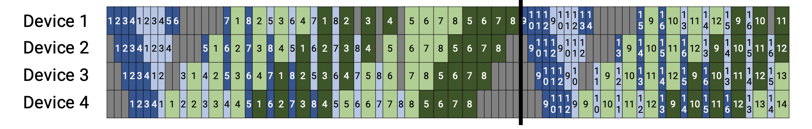
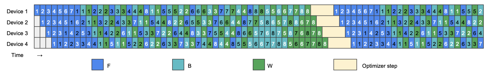
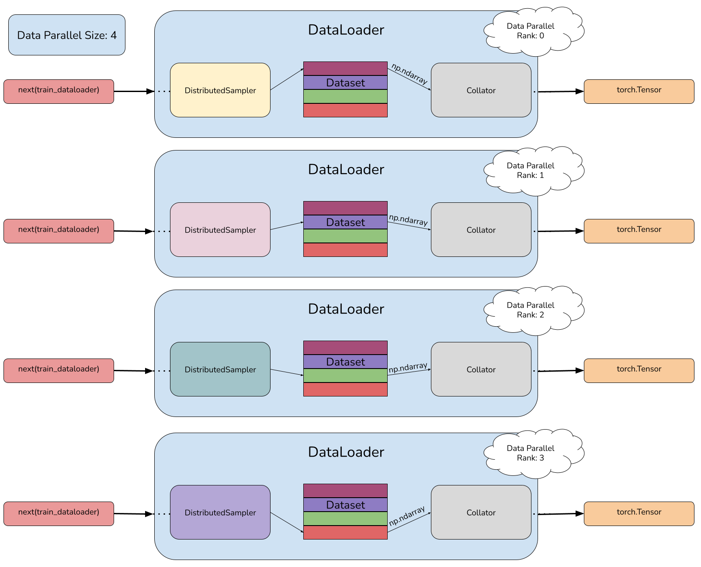
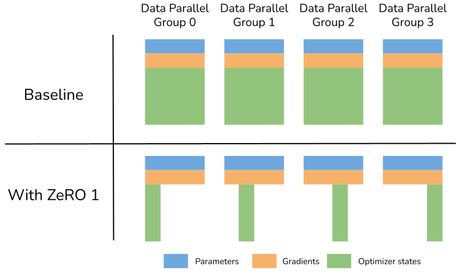

## Introduction

Those times when it was possible to fit an entire model on a single GPU are long gone. Although in recent years we have seen VRAM on GPUs reach up to 120GB, this is still not enough to accommodate state-of-the-art models that require dozens of these GPUs. This is why techniques have emerged to deal with these immense models, capable of leveraging large infrastructures by dividing the work among thousands of GPUs.

For the training of these models, there are mainly two approaches:
- **[FSDP](https://pytorch.org/docs/stable/fsdp.html#torch.distributed.fsdp.FullyShardedDataParallel)** (PyTorch) & **[DeepSpeed](https://github.com/microsoft/DeepSpeed)** (Microsoft). This strategies shard the model layers across several devices. In order to solve the problem of the pipeline bubble (we will expand on this in Section 4 [reference section 4]), each device acts as an independent data parallel group, which leads to an increase in communications. This is not a problem when conducting experiments on a single node since communications are very fast, but when using multiple nodes, the performance decreases significantly. How much it decreases depends on the networking of the cluster, but generally, it is not fast enough compared to the speed at which GPUs process the data.

 > 🚨 There are several scaling studies of these strategies. It is important to pay attention to the networking and hardware they report and compare it with that of your cluster (with this nccl test, for example) to predict the performance of this strategy.

 These strategies are perfectly integrated into `accelerate` and work with all `transformers` models with minimal code modifications.

- **3D Parallelism** [[1]](https://arxiv.org/pdf/1909.08053), [[2]](https://arxiv.org/pdf/2104.04473), [[3]](https://arxiv.org/pdf/2205.05198). This strategy involves dividing not only the model layers but also the parameters of each layer among several devices. We will mainly discuss three types of parallelism: Tensor Parallelism, Pipeline Parallelism, and Data Parallelism. The most interesting ones will be Pipeline and Tensor Parallelism (abbreviated as model parallelism), which handle dividing not only the model layers but also the parameters among several devices. We will then replicate this configuration in the data parallel dimension to scale training.

    This strategy has proven to be the most performant solution, and the differences with FSDP/DeepSpeed increase as more devices are used. Its main drawback is that it requires significant code modifications and is overall more complex and difficult to familiarize oneself with compared to the previous strategy.

In this article, we will delve into the most relevant details of 3D parallelism with [Nanotron⚡️](https://github.com/huggingface/nanotron), the 3D parallel trainer developed by HuggingFace. In a future post, I will delve into the other mentioned strategy.

## Setting up 3D parallelism

During training, we will carry out communications in the three axes of parallelism. To do this, we will need to create a different `torch` `ProcessGroup` for each parallel dimension in each process.

The axis that requires the most interconnection bandwidth is the Tensor Parallel one (we will delve into this issue in Section 3 [REFERENCIA SECTION3]). Therefore, we will always place the processes of the same Tensor Parallel Group on the same node, so we will never use a TP size greater than the number of GPUs per node (Section 3.2 of [[2]](https://arxiv.org/pdf/2104.04473)). If we are unable to fit the model in a single node using tensor parallelism, we will need to divide the model across multiple nodes in the pipeline parallel dimension. The pipeline parallel size will be the smallest possible that allows us to accommodate a copy of the model, and we will use the remaining GPUs to create different copies in the data parallel dimension (Section 5.4.2 of [[2]](https://arxiv.org/pdf/2104.04473)).

In Nanotron, we will first set the different sizes of each parallelism in the config file. Then, during the initialization of the `DistributedTrainer`, we will create a [`ParallelContext`](https://github.com/huggingface/nanotron/blob/67716392ab774a863f1c2f8f73e9571b81ad80a0/src/nanotron/parallel/context.py#L12). This object will be responsible for creating and storing all the `ProcessGroups`, allowing us to access them easily and in an organized manner. Below, we show how to create a `ParallelContext` and how to use it with torch's Distributed communication package.

```python
global_rank = torch.tensor(int(os.environ["RANK"]))
parallel_context = ParallelContext(tensor_parallel_size=2, pipeline_parallel_size=4, data_parallel_size=2)
dist.all_reduce(global_rank, op=dist.ReduceOp.SUM, group=parallel_context.pp_pg)

bc_tensor = torch.empty(1, dtype=torch.int64)
if not parallel_context.world_pg.rank():
    bc_tensor = torch.tensor(42, dtype=torch.int64)

dist.broadcast(bc_tensor, src=0, group=parallel_context.world_pg)

if not parallel_context.pp_pg.rank():
    print(f"[{parallel_context.world_pg.rank()}] Reduced value: {global_rank}, Broadcasted value: {int(bc_tensor)}")
```

    [0] Reduced value: 24, Broadcasted value: 42
    [1] Reduced value: 28, Broadcasted value: 42
    [2] Reduced value: 32, Broadcasted value: 42
    [3] Reduced value: 36, Broadcasted value: 42

In this `ParallelContext`, the processes will be distributed as follows in a setup of 4 nodes with 4 GPUs per node.

> 🚨 Yes, we are showing an example where we do NOT follow the recommendation to prioritize the tensor parallel size and minimize the pipeline parallel size. We do this to more easily visualize the data parallel dimension.



## Pipeline Parallelism

Pipeline parallelism consists of dividing the model layers among several stages (for now, think of each stage as a GPU, although when we discuss tensor parallelism, we will see that this is not always the case). The simplest strategy is to evenly divide the number of decoder layers among the stages, although we won't achieve perfect balance since models also contain other layers like the Embedding layer.

In Nanotron⚡️, each and every layer is wrapped with a [`PipelineBlock`](https://github.com/huggingface/nanotron/blob/67716392ab774a863f1c2f8f73e9571b81ad80a0/src/nanotron/parallel/pipeline_parallel/block.py#L16) module, which is responsible for creating each layer in the corresponding pipeline stage and handling the communications between pipeline stages. To do this, each model ([`LlamaModel`](https://github.com/huggingface/nanotron/blob/67716392ab774a863f1c2f8f73e9571b81ad80a0/src/nanotron/models/llama.py#L790) & [`StarCoder2ForTraining`](https://github.com/huggingface/nanotron/blob/67716392ab774a863f1c2f8f73e9571b81ad80a0/src/nanotron/models/starcoder2.py#L1570)) will have a method that returns the cost for each layer to try to make the division as equitable as possible. Below, we show the [part of the code](https://github.com/huggingface/nanotron/blob/67716392ab774a863f1c2f8f73e9571b81ad80a0/src/nanotron/models/base.py#L190) responsible for calculating the distribution of layers for Llama3-8B with a 8 pipeline stages.

```python
PP_SIZE = 8

model: NanotronModel = LlamaForTraining(config = model_config, parallel_context = parallel_context, parallel_config = parallel_config)

target_pp_ranks = list(range(PP_SIZE))

pipeline_blocks = [module for name, module in model.named_modules() if isinstance(module, PipelineBlock)]
block_compute_costs = model.get_block_compute_costs()
block_cumulative_costs = np.cumsum(
    [
        block_compute_costs[module.module_builder] if module.module_builder in block_compute_costs else 0
        for module in pipeline_blocks
    ]
)

thresholds = [block_cumulative_costs[-1] * ((rank + 1) / PP_SIZE) for rank in range(PP_SIZE)]

target_pp_rank_idx = 0
pp_layers = [ [] for _ in range(PP_SIZE) ]

for block, cumulative_cost in zip(pipeline_blocks, block_cumulative_costs):
  assert target_pp_rank_idx < PP_SIZE
  # Create each layer JUST on the precise rank
  #block.build_and_set_rank(target_pp_ranks[target_pp_rank_idx])
  
  pp_layers[target_pp_rank_idx].append(block.module_builder)
  
  if cumulative_cost > thresholds[target_pp_rank_idx]:
      target_pp_rank_idx += 1

for idx, layers in enumerate(pp_layers):
  print(f"Pipeline Rank {idx} contains {[layer.__name__ for layer in layers]}")
```

    Pipeline Rank 0 contains ['Embedding', 'LlamaDecoderLayer', 'LlamaDecoderLayer', 'LlamaDecoderLayer', 'LlamaDecoderLayer', 'LlamaDecoderLayer']
    Pipeline Rank 1 contains ['LlamaDecoderLayer', 'LlamaDecoderLayer', 'LlamaDecoderLayer', 'LlamaDecoderLayer']
    Pipeline Rank 2 contains ['LlamaDecoderLayer', 'LlamaDecoderLayer', 'LlamaDecoderLayer', 'LlamaDecoderLayer']
    Pipeline Rank 3 contains ['LlamaDecoderLayer', 'LlamaDecoderLayer', 'LlamaDecoderLayer', 'LlamaDecoderLayer', 'LlamaDecoderLayer']
    Pipeline Rank 4 contains ['LlamaDecoderLayer', 'LlamaDecoderLayer', 'LlamaDecoderLayer', 'LlamaDecoderLayer']
    Pipeline Rank 5 contains ['LlamaDecoderLayer', 'LlamaDecoderLayer', 'LlamaDecoderLayer', 'LlamaDecoderLayer']
    Pipeline Rank 6 contains ['LlamaDecoderLayer', 'LlamaDecoderLayer', 'LlamaDecoderLayer', 'LlamaDecoderLayer']
    Pipeline Rank 7 contains ['LlamaDecoderLayer', 'LlamaDecoderLayer', 'TritonRMSNorm', 'TensorParallelColumnLinear', '<lambda>', 'Loss']

Once the model is divided, each time we want to perform a forward/backward pass, we will have to process the inputs with the layers that reside in a specific stage and send the activations to the next/previous rank in the pipeline. This will generate the dreaded pipeline bubble, causing the GPUs to idle while waiting for inputs to process and before the optimizer step. The more pipeline stages we have, the larger the bubble will be, resulting in lower GPU utilization. Therefore, we will always try to reduce the number of pipeline stages. Finally, to alleviate this problem, we will divide the batch into several micro-batches [[4]](https://arxiv.org/abs/1811.06965), so the GPUs will be less time idling waiting for inputs in exchange for having more but smaller communications, which is not a problem.



In the previous image, you can see the simplest pipeline schedule, which consists of first performing a forward pass of all the micro-batches, then a backward pass, and finally updating the parameters (we will refer to this schedule as `All Forward All Backward` schedule). Two years later, the PipeDream-Flush [[5]](https://arxiv.org/abs/2006.09503) schedule emerged, which, although it did not improve the pipeline bubble problem, greatly reduced the memory requirements as the number of micro-batches increased, significantly speeding up model training (`One Forward One Backward` schedule).




Following the PipeDream-Flush schedule, NVIDIA presented a schedule that could reduce the pipeline bubble at the cost of increased communications [[2]](https://arxiv.org/pdf/2104.04473). It achieved this by housing multiple pipeline stages on the same device (`Interleaved One Forward One Backward` schedule). In November 2023, scientists from the Sea AI Lab presented a family of schedules that promised to almost completely eliminate the pipeline bubble problem [[6]](https://arxiv.org/abs/2401.10241v1), and despite their complexity, projects like DeepSeekV2 have already benefited from these schedules [[7]](https://arxiv.org/abs/2405.04434). This schedule promises to eliminate the tensor parallel dimension and, unlike the One Forward One Backward schedules, its performance does not depend on housing many micro-batches, allowing greater control of the global batch size.




Nanotron incorporates [`All Forward All Backward`](https://github.com/huggingface/nanotron/blob/67716392ab774a863f1c2f8f73e9571b81ad80a0/src/nanotron/parallel/pipeline_parallel/engine.py#L165) and [`One Forward One Backward`](https://github.com/huggingface/nanotron/blob/67716392ab774a863f1c2f8f73e9571b81ad80a0/src/nanotron/parallel/pipeline_parallel/engine.py#L222) schedules in [`parallel/pipeline_parallel/engine.py`](https://github.com/huggingface/nanotron/blob/67716392ab774a863f1c2f8f73e9571b81ad80a0/src/nanotron/parallel/pipeline_parallel/engine.py). I highly recommend taking a look at the second one, as we can easily observe the three phases of the schedule (Warm-up, One Forward One Backward, Cool-down).

## Tensor Parallelism

In the previous section we defined pipeline parallelism as the division of the model layers among several stages, tensor parallelism can be seen as the division of the layer parameters among several devices. This allows to split models that do not fit on a single GPU among multiple GPUs without the pipeline parallelism bubble we discussed earlier. The following image illustrates this concept.

[DIAGRAM PIPELINE PARALLELISM VS TENSOR PARALLELISM, foto esa del gh de nvidia]

Tensor parallelism splits the parameters as follows:
- MLP Block: In this block, we will perform GEMM (A) → GELU → GEMM (B) → dropout. Since GeLU is a nonlinear function, we will divide matrix A along its columns `A = [A1, A2]`. This partitioning allows the GeLU nonlinearity to be independently applied to the output of each partitioned GEMM:

    `[Y1, Y2] = [GeLU(XA1), GeLU(XA2)]`

    Hence, we partition the first GEMM in this column parallel fashion and split the second GEMM (B) along its rows so it takes the output of the GeLU layer directly without requiring any communication. The output of the second GEMM is then reduced across the GPUs before passing the output to the dropout layer. This approach splits both GEMMs in the MLP block across GPUs and requires only a single all-reduce operation in the forward pass and another all-reduce in the backward pass.
- Self-attention block: Similarly to the MLP block, in this block we will divide the `Q`, `K` & `V` matrices along their columns and parallelize the second GEMM (B) along its rows. As in the previous case, we perform the operations in this order to reduce synchronizations and respect nonlinear functions. This approach also requires only a single all-reduce operation in the forward pass and a single all-reduce in the backward pass.
- Embedding layer & LM Head: Both operations are also parallelized across the tensor parallel dimension, in the Row and Column axis respectively.

Llama3 8B contains 32 hidden layers, so we will perform 64 all-reduces in the forward pass and another 64 in the backward pass. This is why we always keep the devices belonging to the same tensor parallel group on the same node, as communications are much faster compared to inter-node communications.

Nanotron⚡️ incorporates 3 distinct layers that abstract all the complexity involved in splitting the layers by columns and rows. You can find their definitions in [`parallel/tensor_parallel/nn.py`](https://github.com/huggingface/nanotron/blob/main/src/nanotron/parallel/tensor_parallel/nn.py), though I highly recommend reviewing how they are used to [construct the Llama model](https://github.com/huggingface/nanotron/blob/67716392ab774a863f1c2f8f73e9571b81ad80a0/src/nanotron/models/llama.py#L310).

It is worth noting that Nanotron performs an additional optimization to maximize device utilization by [merging the QKV matrices](https://github.com/huggingface/nanotron/blob/67716392ab774a863f1c2f8f73e9571b81ad80a0/src/nanotron/models/llama.py#L310) in the self-attention layer and the [up gate projections in the MLP layer](https://github.com/huggingface/nanotron/blob/67716392ab774a863f1c2f8f73e9571b81ad80a0/src/nanotron/models/llama.py#L149). This way, we perform the operations in a single GEMM instead of [multiple ones](https://github.com/huggingface/transformers/blob/25245ec26dc29bcf6102e1b4ddd0dfd02e720cf5/src/transformers/models/llama/modeling_llama.py#L413).

## Data Parallelism

Once we have defined how we want to split the model among several devices, we will enable data parallelism to process more samples from the dataset in parallel. To do this, we will create `N` copies of the model (remember that each copy will be composed of `Pipeline Parallel Size X Tensor Parallel Size` devices) and divide the dataset into `N` splits, providing each copy with a different split. This parallelism degree is the simplest to implement and has the least overhead since it only adds a collective call to synchronize the gradients in each training step.

Gradient synchronization in Nanotron will be done by [`wrapping the models`](https://github.com/huggingface/nanotron/blob/67716392ab774a863f1c2f8f73e9571b81ad80a0/src/nanotron/trainer.py#L801) with the [`DistributedDataParallel`](https://pytorch.org/docs/stable/generated/torch.nn.parallel.DistributedDataParallel.html#torch.nn.parallel.DistributedDataParallel) class from PyTorch. Additionally, we will create the same Dataset and DataLoader in each and every process, and with the help of the [`DistributedSampler`](https://github.com/huggingface/nanotron/blob/67716392ab774a863f1c2f8f73e9571b81ad80a0/src/nanotron/dataloader.py#L431C19-L431C37), we will divide the indices of the Dataset among the different data parallel groups.



You may wonder why we create the same `Dataset` and `DataLoader` in all processes if only the first stage of the pipeline and the last need the inputs and the labels, respectively. Nanotron addresses this issue with [`TensorPointer`s](https://github.com/huggingface/nanotron/blob/main/src/nanotron/parallel/pipeline_parallel/tensor_pointer.py#L5), which indicate where the inputs come from and where to send the outputs in each stage of the pipeline. We will create them in the [collator](https://github.com/huggingface/nanotron/blob/67716392ab774a863f1c2f8f73e9571b81ad80a0/src/nanotron/dataloader.py#L329), the last step before feeding data into the model, so the shard of the model on each device will get either the inputs (the first pipeline stage will get tokenized samples from the dataset), the labels (for computing the loss in the last stage of the pipeline), or a `TensorPointer` to know whether to consume data from the `DataLoader` or receive the inputs from antoher pipeline stage.

Finally, Nanotron also incorporates the [`Zero-1 optimizer`](https://github.com/huggingface/nanotron/blob/67716392ab774a863f1c2f8f73e9571b81ad80a0/src/nanotron/optim/zero.py#L25). Without going into too much detail, this optimizer shards the optimizer states across the data parallel groups, which reduces memory consumption and allows us to increase the batch size. To activate it, we only need to specify it in the YAML config file (`optimizer.zero_stage = 1`).



## To sum up

Throughout this post, we have covered the fundamental aspects of 3D parallelism, the technology that powers LLMs. The most important aspects of each parallelism axis are:

- Tensor Parallelism: When a model does not fit on a single device, we first try to divide it in the tensor parallel dimension. The performance of this method depends largely on the bandwidth between devices, so we will **NEVER** divide the model across devices of different nodes.

- Pipeline Parallelism: When tensor parallelism is not enough, we divide the model among several pipeline stages. We will always try to make the division among the stages as balanced as possible. This parallelism has a significant drawback, the pipeline bubble, so we will use the less pipeline stages as possible. There are various pipeline schedules that trade memory consumption, communications and complexity.

- Data Parallelism: Once we define the sizes of the pipeline and tensor axis (a.k.a. Model Parallelism), we will use data parallelism to scale up training with more devices. Use the Zero-1 Optimizer to reduce memory consumption and increase the batch size to achieve greater device utilization.

After reading this post, you should be familiar with the basic pillars of large-scale LLM training, but we have left out more complex aspects such as sequence parallelism [[3]](https://arxiv.org/pdf/2205.05198), asynchronous tensor parallelism, the ZeRO-2 optimizer [[8]](https://arxiv.org/abs/1910.02054), selective activation recomputation [[3]](https://arxiv.org/pdf/2205.05198), and many more. I encourage you to explore these on your own and, above all, to experiment with everything we have covered in this post using libraries like [Megatron](https://github.com/NVIDIA/Megatron-LM) or [Nanotron ⚡️](https://github.com/huggingface/nanotron)!

# Did you find this page helpful? Consider sharing it 🙌