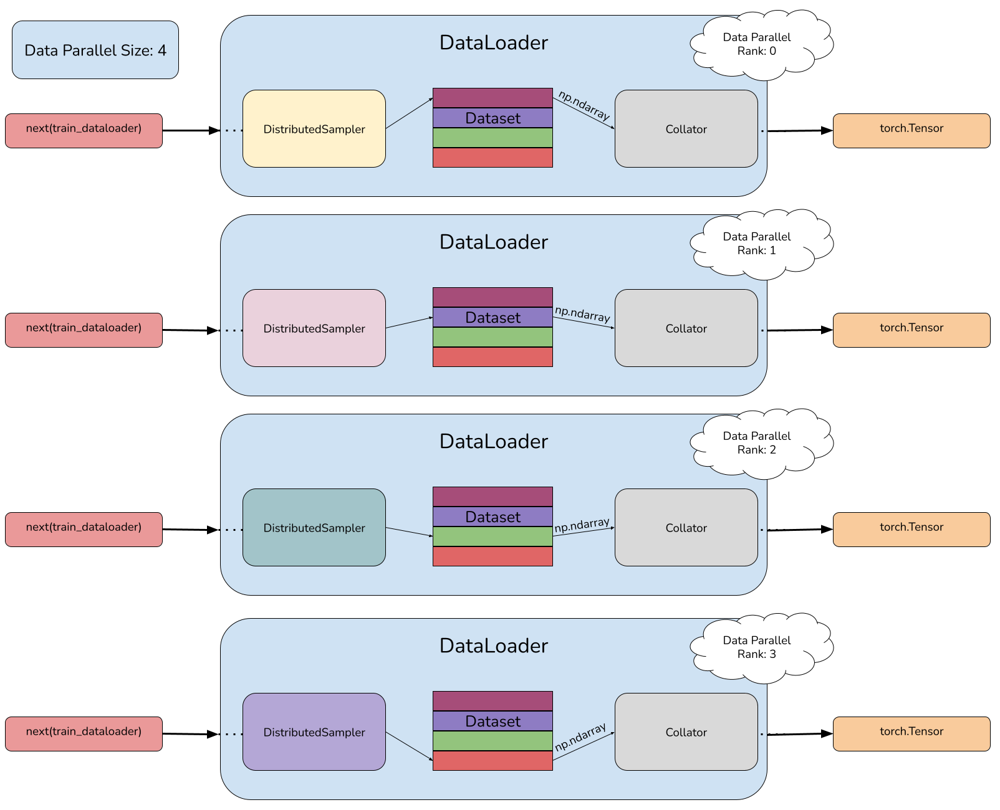

# Introduction

In this post, we will address the fundamental aspects of Torch's `Dataset`s and `DataLoader`s, considering an environment with **Data, Pipeline and Tensor Parallelism** and including functionalities to resume training after an interruption. To do this, we will introduce [`Nanoset`s](https://github.com/TJ-Solergibert/nanotron/blob/nanosets/src/nanotron/data/nanoset.py), a dataset that I have developed for training LLMs at scale for [`Nanotron`](https://github.com/TJ-Solergibert/nanotron), the 3D parallelism trainer developed by Hugging Face 🤗. 

# Nanosets
Our objective for training LLMs is to build batches containing `batch_size` samples with `sequence_length` tokens for the `input_ids` and `labels`. To achieve this, we will present the `Nanosets`, a dataset based on [numpy memory-mapped arrays](https://numpy.org/doc/stable/reference/generated/numpy.memmap.html), which allows to easily read bytes of data from local disk. These bytes we will read are the tokens of the documents with which we want to train our model. In order not to lengthen this article, we will start from the assumption that we already have the tokenized documents stored in a file, where each token is represented by 2 bytes.
## Torch's Dataset
Below we show the source code of the Nanosets.

```python
from typing import Dict, List, Union

import numpy as np
import torch

from torch.utils.data import Dataset

from nanotron import logging
from nanotron.data.utils import count_dataset_indexes, normalize
from nanotron.data.nanoset import build_nanoset_index_helper

logger = logging.get_logger(__name__)

class Nanoset(Dataset):
    """
    The Nanoset dataset

    Args:
        dataset_paths (List[str]): List of paths to tokenized datasets
        dataset_weights (List[float]): List with the weights for weighted datasets. If None, consume all samples from all datasets without weighting. Weights are normalized in __init__
        sequence_length (int): Sequence length of the built samples
        train_split_num_samples (int): Number of samples the dataset needs. It's the training steps * global batch size
    """

    def __init__(
        self,
        dataset_paths: List[str],
        dataset_weights: Union[List[float], None],
        sequence_length: int,
        train_split_num_samples: int,
        random_seed: int = 1234,
    ) -> None:

        # Init
        self.dataset_paths = dataset_paths
        self.dataset_weights = dataset_weights
        self.sequence_length = sequence_length
        self.train_split_num_samples = train_split_num_samples
        self.random_seed = random_seed

        # Build Nanoset Index
        ## To build the index we need the length of each dataset
        self.dataset_lengths = []
        for dataset_path in self.dataset_paths:
            self.dataset_buffer_mmap = np.memmap(dataset_path, mode="r", order="C", dtype=np.uint16)
            self.dataset_buffer = memoryview(self.dataset_buffer_mmap)
            dataset_tokens = int(len(self.dataset_buffer))
            number_of_samples = int(
                (dataset_tokens - 1) / sequence_length
            )  # Discard last sample of length < sequence_length
            self.dataset_lengths.append(number_of_samples)
        ## Set dataset weights
        if (
            self.dataset_weights is None
        ):  # Case of training with > 1 datasets without weighting them: Consume both datasets entirely on each epoch
            self.dataset_weights = normalize(self.dataset_lengths)
        else:
            self.dataset_weights = normalize(dataset_weights)
        ## Build dataset index and dataset sample index
        self.dataset_index, self.dataset_sample_index = self.build_nanoset_index()

        self.print_nanoset_info()

    def __getitem__(self, idx: int) -> Dict[str, np.ndarray]:
        """
        Returns sequence_length + 1 tokens from the memmap dataset

        Args:
            idx (int): The index into the dataset

        Returns:
            Dict[str, numpy.ndarray]: The input ids wrapped in a dictionary
        """

        dataset = self.dataset_index[idx]
        dataset_sample = self.dataset_sample_index[idx]

        # Rebuild the memmap in every access to free memory
        # https://stackoverflow.com/a/61472122
        self.dataset_buffer_mmap = np.memmap(self.dataset_paths[dataset], mode="r", order="C", dtype=np.uint16)
        self.dataset_buffer = memoryview(self.dataset_buffer_mmap)

        # dtype=uint16, 2 bytes per token
        offset = dataset_sample * self.sequence_length * 2
        input_ids_tokens = np.frombuffer(
            self.dataset_buffer, dtype=np.uint16, count=(self.sequence_length + 1), offset=offset
        )

        # Return tokens as np.int32 as Torch can't handle uint16
        return {"input_ids": input_ids_tokens.astype(np.int32)}
    
    def __len__(self) -> int:
        """
        Returns:
            int: The number of samples of the Nanoset
        """

        return len(self.dataset_index)

    def build_nanoset_index(self) -> np.ndarray:
        """
        Build dataset index and dataset sample index
        """
        # Compute samples per epoch and number of epochs
        samples_per_epoch = sum(self.dataset_lengths)
        num_epochs = int(self.train_split_num_samples / samples_per_epoch) + 1
        # Build the dataset indexes for 1 epoch
        dataset_index, dataset_sample_index = build_nanoset_index_helper(
            n_samples=samples_per_epoch, weights=self.dataset_weights, dataset_sizes=self.dataset_lengths
        )
        # Shuffle the indexes the same way
        numpy_random_state = np.random.RandomState(self.random_seed)
        numpy_random_state.shuffle(dataset_index)
        numpy_random_state = np.random.RandomState(self.random_seed)
        numpy_random_state.shuffle(dataset_sample_index)
        # Concatenate num_epochs the shuffled indexes
        dataset_index = np.concatenate([dataset_index for _ in range(num_epochs)])
        dataset_sample_index = np.concatenate([dataset_sample_index for _ in range(num_epochs)])
        # Just keep the necessary samples
        dataset_index = dataset_index[: self.train_split_num_samples]
        dataset_sample_index = dataset_sample_index[: self.train_split_num_samples]

        return dataset_index, dataset_sample_index

    def print_nanoset_info(self):

        print(f"> Total number of samples: {len(self)}")
        print(f"> Total number of tokens: {len(self) * self.sequence_length}")

        # Print samples from each dataset + weight
        dataset_sample_count = count_dataset_indexes(self.dataset_index, len(self.dataset_paths))
        for index, sample_count in enumerate(dataset_sample_count):
            print(f">   Total number of samples from the {self.dataset_paths[index].rsplit('/', 1)[-1]} dataset: {sample_count} ({round(normalize(dataset_sample_count).tolist()[index], 2)})")
```

The 3 core aspects of a `Dataset` are:
- **\_\_init\_\_**: This method will be responsible for creating our dataset based on the arguments we introduce. Here we build all the logic related to how we interact with the `Dataset`.
  
  In our case, the parameters characterizing each `Nanoset` are as follows:
    - `dataset_paths`: One or multiple paths to the datasets containing tokenized documents.
    - `dataset_weights`: If we train the model with >1 datasets, we can specify the proportion of samples from each one during training.
    - `sequence_length`: Each sample of the `Nanoset` will contain `sequence_length` tokens*.
    - `train_split_num_samples`: The minimum number of samples required to build the `Nanoset`. In case the datasets are not large enough, we will consume them repeatedly (Epochs).
  
  With these parameters, the first thing we will do is compute the `dataset_length` of each dataset, which will be determined by the `number_of_total_tokens / sequence_length`, discarding the last sample since its length < `sequence_length`.

  Based on the `dataset_lengths`, the `dataset_weights` and the `number_of_samples_per_epoch` (defined as the `sum(dataset_lengths)`), we build the two indexes we need in order to extract samples from the `Nanoset`  ([build_nanoset_index_helper](https://github.com/TJ-Solergibert/nanotron/blob/07601a9ed89973584686639555268e1c1b52f93a/src/nanotron/data/nanoset.py#L152)):
      
    - `dataset_index`: Contains the index of the dataset from the list of `dataset_paths` from which to extract the sample, respecting the established dataset weight.
        
        ```
        Given:

        D = [d0, d1, d2, d3]        # datasets
        DL = [8, 2, 5, 5]           # dataset lengths
        W = [0.1, 0.5, 0.3, 0.1]    # dataset weights
        SPE = 20                    # number of samples per epoch

        Then, for example:

        dataset_index = [1, 2, 0, 1, 3, 1, 2, 1, 2, 1, 0, 1, 2, 1, 3, 1, 2, 1, 2, 1]
        ```
    - `dataset_sample_index`: Contains the sample index to extract from the `dataset_index[index]` dataset, always < `len(dataset)`.
        ```
        dataset_index =         [1, 2, 0, 1, 3, 1, 2, 1, 2, 1, 0, 1, 2, 1, 3, 1, 2, 1, 2, 1]
        dataset_sample_index =  [0, 0, 0, 1, 0, 0, 1, 1, 2, 0, 1, 1, 3, 0, 1, 1, 4, 0, 0, 1]
        ```

      Then, we **shuffle with the same permutation both indexes** and concatenate them `number_of_epochs` times, which is defined by `train_split_num_samples` / `number_of_samples_per_epoch`.
    
        ```
        Given:

        N = 70                      # train split num samples

        dataset_index =         [1, 2, 0, 1, 3, 1, 2, 1, 2, 1, 0, 1, 2, 1, 3, 1, 2, 1, 2, 1]
        dataset_sample_index =  [0, 0, 0, 1, 0, 0, 1, 1, 2, 0, 1, 1, 3, 0, 1, 1, 4, 0, 0, 1]

        Shuffle dataset_index and dataset_sample_index:

        dataset_index =         [1, 1, 0, 2, 3, 1, 3, 1, 2, 2, 1, 1, 0, 1, 1, 2, 1, 2, 2, 1]
        dataset_sample_index =  [1, 0, 0, 4, 1, 0, 0, 0, 2, 0, 0, 1, 1, 0, 1, 0, 1, 3, 1, 1]

        n_concatenations = (70/(20)) + 1 = 4
        dataset_index = dataset_index concatenated 4 times
        dataset_sample_index = dataset_sample_index concatenated 4 times

        dataset_index = dataset_index[: N]
        dataset_sample_index = dataset_sample_index[: N]
        ```
  
- **\_\_getitem\_\_**: This method will be responsible of building the samples queried to the `Dataset`. Here is where we will handle all the costly operations related to each sample we want to extract, such as reading files, preprocessing or data augmentation. 
  In our case, to query the `Nanoset` for the *k-th* sample we use the `dataset_index` to retrieve the corresponding dataset from `D` and the `dataset_sample_index` to retrieve the corresponding sample from that dataset.
  ```
  sample = D[dataset_index[k]][dataset_sample_index[k]]
  ```
  As we have already mentioned, each dataset is a file where each token is represented by 2 bytes. To construct the samples, we will build a memory-mapped array from this file (`dataset_index[k]`), and from the `dataset_sample_index[k]`, we will extract `sequence_length + 1` tokens (Remember that the labels for the model training are the inputs with a 1 position shift).
- **\_\_len\_\_**: This method will include the logic that establishes the number of samples we have in the `Dataset`. This value is essential for the `DataLoader` to know the positions it can query from the `Dataset`.

The following snippet shows how to create a `Nanoset` and extract samples. It is worth to mention that we will create the **same `Nanoset`** in **each and every process** involved in the training of the model. 

```python
SEQUENCE_LENGTH = 8192
BATCH_SIZE = 4

train_nanoset = Nanoset(dataset_paths=["datasets/yelp_review_full_input_ids.npy"], 
                        dataset_weights=None, 
                        sequence_length=SEQUENCE_LENGTH, 
                        train_split_num_samples=1000)
```

    > Total number of samples: 1000
    > Total number of tokens: 8192000
    >   Total number of samples from the yelp_review_full_input_ids.npy dataset: 1000 (1.0)

```python
train_nanoset[23]
```

    {'input_ids': array([   13,   911, 23750, ...,  2185, 34443, 16405], dtype=int32)}

## Torch's DataLoader
Now that we know how to build a `Dataset` and how to extract samples from it, let's move on to building the `DataLoader`. The `DataLoader` will have the help of a *collator* and a *sampler*.

### The Sampler
The *sampler* will contain the list of indices that the `DataLoader` has to extract from the `Dataset`. For this, it will create a sample index with `len(Dataset)` indices.

In our case, as we will have Data Parallelism, **we must avoid consuming the same sample repeatedly during an epoch**. To do this, we will use the `DistributedSampler`, which will divide the indices of the `Dataset` by the Data Parallel size. For this, we will have to specify the Data Parallel Size (Common in all processes) and the Data Parallel Rank.

> 🚨 Due to how the training loop is designed, it expects to never exhaust all the batches that the `DataLoader` can produce. This is why, during the creation of the `Nanoset` indices, we concatenate them a sufficient number of times to never run out of samples, but before this process, we shuffle them. We shuffle the data at this moment and not in the sampler because this way, we ensure that in each epoch, we consume all the samples from each of the datasets.

In the following way, we will create the `DistributedSampler` in the processes that belong to the first Data Parallel Rank with a Data Parallel Size of 4.

```python
from torch.utils.data.distributed import DistributedSampler

sampler = DistributedSampler(train_nanoset, num_replicas=4, rank=0, shuffle=False)
```

These will be the indices that we will query from the `Dataset`.

```python
sampler = iter(sampler)
for _ in range(5):
    print(next(sampler))
```

    0
    4
    8
    12
    16

And this is how we create the `DistributedSampler` for the processes belonging to the second Data Parallel Rank. As can be seen, the sampler access different indices from the `Dataset`.

```python
sampler_1 = DistributedSampler(train_nanoset, num_replicas=4, rank=1, shuffle=False)
sampler_1 = iter(sampler_1)
for _ in range(5):
    print(next(sampler_1))
```

    1
    5
    9
    13
    17

### The Collator

If we look at the \_\_getitem\_\_ method of the `Nanoset`, we observe how each sample is a dictionary containing the tokens in a numpy array. But, weren't the model inputs of type `torch.Tensor`? And where are the labels? In the case of having pipeline parallelism, we only need the inputs in the first stage and the labels in the last one, right? All these questions will be addressed in the *collator*.

The *collator* will be responsible for carrying out a final data processing step on each sample before feeding them into the model. This final step often depends on more specific variables of each process, such as the Data Parallel Rank or the Pipeline stage. While it is true that we could do this in the \_\_getitem\_\_ method, it's better to do it in the collator so we construct exactly the same `Nanoset` in all processes.

Below we show the *collator* that we will use with the `Nanosets` in `Nanotron`. As can be seen, we will distinguish between the processes at the beginning of the pipeline (which will require the inputs), those at the last stage of the pipeline (which will require the labels), and the rest. It will also be responsible for creating the labels from the inputs (Shifting the tokens 1 position to the right) and transforming all arrays into `torch.Tensor`s.

```python
import dataclasses

from nanotron.parallel.pipeline_parallel.tensor_pointer import TensorPointer

@dataclasses.dataclass
class DataCollatorForCLM:
    """
    Data collator used for causal language modeling.

    - input_pp_rank: Feeds the input_ids to the model
    - output_pp_rank: Feeds the labels to the model
    - other pp ranks: Don't have data. Instead, we use `TensorPointer` to point to the pipeline rank having the data. Used by Nanotron's pipeline engine.
    """

    sequence_length: int
    input_pp_rank: int
    output_pp_rank: int
    current_pp_rank: int

    def __call__(self, examples: List[Dict[str, List[np.ndarray]]]) -> Dict[str, Union[torch.Tensor, TensorPointer]]:
        # Process the case when current rank doesn't require data. We return `TensorPointer` that points to ranks having the data.
        if self.current_pp_rank not in [
            self.input_pp_rank,
            self.output_pp_rank,
        ]:
            assert all(len(example) == 0 for example in examples)
            return {
                "input_ids": TensorPointer(group_rank=self.input_pp_rank),
                "input_mask": TensorPointer(group_rank=self.input_pp_rank),
                "label_ids": TensorPointer(group_rank=self.output_pp_rank),
                "label_mask": TensorPointer(group_rank=self.output_pp_rank),
            }

        # Make sure we load `input_ids` column.
        assert all(list(example.keys()) == ["input_ids"] for example in examples)

        input_ids = np.vstack([examples[i]["input_ids"] for i in range(len(examples))])  # (b, s)
        batch_size, expanded_input_length = input_ids.shape

        result: Dict[str, Union[np.ndarray, TensorPointer]] = {}

        result["input_ids"] = TensorPointer(group_rank=self.input_pp_rank)
        result["input_mask"] = TensorPointer(group_rank=self.input_pp_rank)
        result["label_ids"] = TensorPointer(group_rank=self.output_pp_rank)
        result["label_mask"] = TensorPointer(group_rank=self.output_pp_rank)

        assert (
            expanded_input_length == self.sequence_length + 1
        ), f"Samples should be of length {self.sequence_length + 1} (seq_len+1), but got {expanded_input_length}"

        # Process inputs: last token is the label
        if self.current_pp_rank == self.input_pp_rank:
            result["input_ids"] = input_ids[:, :-1]
            result["input_mask"] = np.ones((batch_size, self.sequence_length), dtype=np.bool_)

        # Process labels: shift them to the left
        if self.current_pp_rank == self.output_pp_rank:
            result["label_ids"] = input_ids[:, 1:]
            result["label_mask"] = np.ones((batch_size, self.sequence_length), dtype=np.bool_)

        if isinstance(result["input_ids"], torch.Tensor) and result["input_ids"].shape[-1] != self.sequence_length:
            raise ValueError(
                f"`labels` are incorrectly preprocessed. `labels` length is {result['input_ids'].shape[-1]}, but should be"
                f" {self.sequence_length}."
            )
        if isinstance(result["label_ids"], torch.Tensor) and result["label_ids"].shape[-1] != self.sequence_length:
            raise ValueError(
                f"`labels` are incorrectly preprocessed. `labels` length is {result['label_ids'].shape[-1]}, but should be"
                f" {self.sequence_length}."
            )

        # Cast np.array to torch.Tensor
        result = {k: v if isinstance(v, TensorPointer) else torch.from_numpy(v) for k, v in result.items()}
        return result
```

This is how we create a *collator* and an example of what it will produce from each sample extracted from the `Nanoset`.

```python
collator = DataCollatorForCLM(sequence_length=SEQUENCE_LENGTH, input_pp_rank=0, output_pp_rank=0, current_pp_rank=0)
collator([{"input_ids": np.random.randint(0, 1000, size=(SEQUENCE_LENGTH +1,))}])
```

    {'input_ids': tensor([[331, 141,  27,  ..., 632, 494, 340]]),
     'input_mask': tensor([[True, True, True,  ..., True, True, True]]),
     'label_ids': tensor([[141,  27, 187,  ..., 494, 340, 902]]),
     'label_mask': tensor([[True, True, True,  ..., True, True, True]])}

### The DataLoader

After building the `Dataset` from which we will extract samples, the *sampler* containing which samples to extract, and the *collator* that will take care of formatting the samples to feed them into the model, we can finally jump into building the DataLoader! We simply need to input these 3 elements along with the desired `batch_size`.

```python
from torch.utils.data import DataLoader

train_dataloader = DataLoader(
        train_nanoset,
        batch_size=BATCH_SIZE,
        sampler=sampler,
        collate_fn=collator,
    )
```

Next, we show the contents of each batch that we will input into the model and the dimensions of the most relevant tensors.

```python
train_dataloader = iter(train_dataloader)
batch = next(train_dataloader)
print(batch)
```

    {'input_ids': tensor([[19978, 21420,   543,  ..., 15494,   355,   257],
            [  257,  1256,  1342,  ...,  1424,   379,   428],
            [  460,   470,  4255,  ...,   518,   373,   922],
            [  326,   314,  4444,  ...,   340,   338,   287]], dtype=torch.int32), 'input_mask': tensor([[True, True, True,  ..., True, True, True],
            [True, True, True,  ..., True, True, True],
            [True, True, True,  ..., True, True, True],
            [True, True, True,  ..., True, True, True]]), 'label_ids': tensor([[21420,   543,  1234,  ...,   355,   257, 21239],
            [ 1256,  1342, 38635,  ...,   379,   428,  4067],
            [  470,  4255,  2861,  ...,   373,   922,    13],
            [  314,  4444,   510,  ...,   338,   287,   262]], dtype=torch.int32), 'label_mask': tensor([[True, True, True,  ..., True, True, True],
            [True, True, True,  ..., True, True, True],
            [True, True, True,  ..., True, True, True],
            [True, True, True,  ..., True, True, True]])}

```python
for idx in range(4):
    batch = next(train_dataloader)
    print(f'[Batch {idx}] input_ids shape: {batch["input_ids"].shape}. label_ids shape: {batch["label_ids"].shape}')
```

    [Batch 0] input_ids shape: torch.Size([4, 8192]). label_ids shape: torch.Size([4, 8192])
    [Batch 1] input_ids shape: torch.Size([4, 8192]). label_ids shape: torch.Size([4, 8192])
    [Batch 2] input_ids shape: torch.Size([4, 8192]). label_ids shape: torch.Size([4, 8192])
    [Batch 3] input_ids shape: torch.Size([4, 8192]). label_ids shape: torch.Size([4, 8192])

I recommend that you consult the [documentation of Torch's `DataLoader`s](https://pytorch.org/docs/stable/data.html#torch.utils.data.DataLoader) and explore other parameters such as `num_workers`, `drop_last`, or `pin_memory`!

#### Checkpointing and resuming training

During training, interruptions are possible (such as GPU crashing, exceeding the time limit of the cluster policy, cluster down for maintenance, etc.), and there's nothing worse than having to start training all over again, right? That's why it's essential to program checkpointing mechanisms that store the model's state, but also of the `DataLoader`'s states in order to avoid consuming the same data again. To achieve this, we will have to store the number of samples consumed at the moment at which we took the checkpoint along with the model and, once we resume training, skip this number of samples in the *sampler*.

Below, we show an example of how training is stopped at iteration 18 when we were going to consume sample 70. And how, upon resuming training, with the help of the `SkipBatchSampler`, we skip the first `17*batch_size` samples to resume training from sample 70.

```python
init_sampler = DistributedSampler(train_nanoset, num_replicas=4, rank=2, shuffle=False)

CRASH_AT_ITERATION = 17

for iter, sample in enumerate(init_sampler):
    if iter == CRASH_AT_ITERATION:
        break

print(sample)
```

    70

```python
from torch.utils.data import BatchSampler

class SkipBatchSampler(BatchSampler):
    """
    A `torch.utils.data.BatchSampler` that skips the first `n` batches of another `torch.utils.data.BatchSampler`.
    Note that in case of DDP, we skip batches on each rank, so a total of `skip_batches * parallel_context.dp_pg.size()` batches
    """

    def __init__(self, batch_sampler: BatchSampler, skip_batches: int, dp_size: int):
        self.batch_sampler = batch_sampler
        # In case of DDP, we skip batches on each rank, so a total of `skip_batches * parallel_context.dp_pg.size()` batches
        self.skip_batches = skip_batches // dp_size

    def __iter__(self):
        for index, samples in enumerate(self.batch_sampler):
            if index >= self.skip_batches:
                yield samples
```

```python
resume_sampler = DistributedSampler(train_nanoset, num_replicas=4, rank=2, shuffle=False)
resume_sampler = SkipBatchSampler(resume_sampler, 4*CRASH_AT_ITERATION, 4)

for sample in resume_sampler:
    print(sample)
    break
```

    70

# To sum up
Throughout this post, we have seen the fundamental aspects of `Datasets` and `DataLoaders`, introducing `Nanoset`s, a `Dataset` for training LLMs at scale.

In summary, to create a `DataLoader` we need:
- `Dataset`: An object that we can index to extract samples. In environments with Data Parallelism, we will create the same `Dataset` in all processes. We should pay attention to the following methods:
  - **\_\_init\_\_**: Method invoked during the object creation where we will establish its attributes and build the necessary logic to extract samples.
  - **\_\_getitem\_\_**: Method to extract samples from the `Dataset`. This is where we will carry out more costly operations such as IO or preprocessing.
  - **\_\_len\_\_**: Method that returns the number of samples we can query to the `Dataset`, essential for the `DataLoader`'s *sampler*.
- *Sampler*: It will contain the indices that the `DataLoader` will extract from the `Dataset`. With Data Parallelism, we will use the `DistributedSampler`, which will divide the `Dataset` indices among the different Data Parallel Ranks. To resume training properly, it will be necessary to store the model checkpoint along with the number of total samples consumed.
- *Collator*: Responsible for the final step of data processing before feeding batches of data into the model.
`
With all of this, you are now ready to construct any `DataLoader` you propose 🥳! Here is a diagram summarizing all the components to build custom `DataLoader`s and how they interact with each other.



Soon, I will publish a second part introducing Torch's [`IterableDataset`](https://pytorch.org/docs/stable/data.html#torch.utils.data.IterableDataset)s, which allows us to stream and tokenize text on the fly but requires additional logic both to build the batches and to resume training after an interruption (Fundamental for large-scale training).

# Did you find this page helpful? Consider sharing it 🙌
